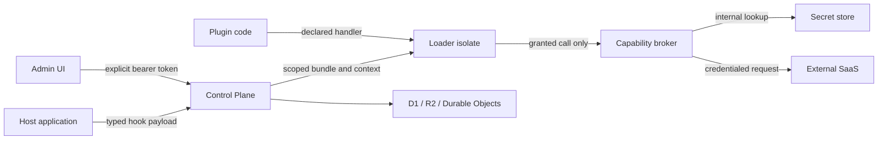

# TenantScript Threat Model

Status: implemented controls and known gaps on `main`  
Last reviewed: 2026-07-20

This document is the public security model for TenantScript. It maps assets and trust boundaries to concrete mitigations and permanent tests. A passing test proves only the named repository-controlled behavior; it does not certify a deployment or replace an external security review.

## Security objectives

TenantScript must:

1. prevent plugin code from obtaining raw credentials or authority outside its installation grants;
2. prevent app and tenant identities from reading or mutating each other's resources;
3. keep approval, rollback, budget, and audit decisions bound to authenticated identity and stored state;
4. reject outbound destinations outside an explicit public-origin allowlist;
5. expose operational evidence without reflecting secrets, customer payloads, or executable markup;
6. fail with bounded, structured errors for untrusted manifest, config, and hook payload input.

Protected assets include provider credentials, tenant data, plugin artifacts, grants, installation configuration, approval state, execution/audit records, budget counters, and administrator authority.

## System and trust boundaries



| Boundary                                  | Untrusted side                                     | Trusted enforcement point                                               | Primary risk                                              |
| ----------------------------------------- | -------------------------------------------------- | ----------------------------------------------------------------------- | --------------------------------------------------------- |
| Host application → Control Plane          | Hook payload and caller-provided identifiers       | Authenticated identity, payload schema, scoped API handlers             | tenant spoofing, malformed payload, stored-data confusion |
| Plugin code → Loader isolate              | Tenant-authored bundle and handler behavior        | isolated globals, timeout and subrequest budgets, scoped context        | secret extraction, infinite loop, raw egress              |
| Loader isolate → Capability broker        | Capability name and arguments                      | resolved installation grants and broker-side provider adapter           | grant escalation, scope bypass, replay tampering          |
| Capability broker → Secret store          | Provider reference and tenant context              | broker-only secret access                                               | plaintext exposure or cross-tenant credential use         |
| Capability broker → External SaaS         | Destination and provider payload                   | provider adapter, destination/scope validation                          | credential forwarding, redirect/allowlist bypass          |
| Control Plane → D1 / R2 / Durable Objects | app, tenant, resource IDs and concurrent mutations | identity-derived scope, storage predicates, revision/idempotency guards | cross-tenant access, race, audit corruption               |
| Admin UI → Control Plane                  | browser input and server-controlled labels         | explicit bearer authorization, text rendering, origin allowlist         | CSRF, XSS, privilege confusion                            |
| Workspace package → package               | dependency declaration and import path             | reviewed dependency graph and CI boundary checker                       | sandbox/control-plane responsibility collapse             |

## Attack, mitigation, and permanent-test map

Each implemented mitigation below has a named test. A new attack surface must add a row and a failing adversarial or fuzz test in the same pull request.

| Attack                                                             | Mitigation                                                                                        | Permanent evidence                                                                                                                                                                                                                                                                                       |
| ------------------------------------------------------------------ | ------------------------------------------------------------------------------------------------- | -------------------------------------------------------------------------------------------------------------------------------------------------------------------------------------------------------------------------------------------------------------------------------------------------------- |
| process, binding, raw secret, or namespace extraction              | Loader supplies a scoped context without ambient process/bindings                                 | `does not expose process, raw secret bindings, or global namespaces` in [`packages/loader/test/security-suite.test.ts`](../../packages/loader/test/security-suite.test.ts)                                                                                                                               |
| raw egress, runaway execution, or subrequest exhaustion            | deny-by-default fetch plus timeout and call budgets                                               | `denies raw outbound fetch and keeps an audit entry`, `maps infinite-loop handlers to timeout execution status`, and `blocks capability calls beyond the loader subrequest budget` in [`packages/loader/test/security-suite.test.ts`](../../packages/loader/test/security-suite.test.ts)                 |
| capability grant, channel, role, resume-hook, or tenant escalation | Broker checks the resolved grant and bound tenant before provider execution                       | denial cases in [`packages/capabilities/test/security-suite.test.ts`](../../packages/capabilities/test/security-suite.test.ts)                                                                                                                                                                           |
| capability journal input tampering                                 | Stored input hash must match before replay; provider is not called on mismatch                    | `rejects a tampered journal entry instead of replaying it or calling the provider` in [`packages/capabilities/test/security-suite.test.ts`](../../packages/capabilities/test/security-suite.test.ts)                                                                                                     |
| brokered HTTP redirect, credential, or header scope bypass         | Every hop must remain public and in the exact-origin grant; credentials are reinjected per origin | HTTP denial and redirect cases in [`packages/capabilities/test/security-suite.test.ts`](../../packages/capabilities/test/security-suite.test.ts)                                                                                                                                                         |
| `kv.state` tenant, plugin, version, or quota boundary bypass       | Scope comes only from trusted host context; transaction enforces UTF-8 byte and entry limits      | `rejects kv.state scope spoofing and keeps tenant facets isolated` in [`packages/capabilities/test/security-suite.test.ts`](../../packages/capabilities/test/security-suite.test.ts)                                                                                                                     |
| forged rollback, install, approval, cursor, or budget authority    | API derives scope and role from authenticated identity and persists guarded state                 | identity, cursor, approval, budget, and permission cases in [`packages/control-plane/test/security-suite.test.ts`](../../packages/control-plane/test/security-suite.test.ts)                                                                                                                             |
| schema retirement bypass or cross-role blocker disclosure          | App-wide usage blocks removal; blocker details require owner/admin authority                      | retirement cases in [`packages/control-plane/test/schema-migrations.workers.test.ts`](../../packages/control-plane/test/schema-migrations.workers.test.ts) and role disclosure cases in [`packages/control-plane/test/security-suite.test.ts`](../../packages/control-plane/test/security-suite.test.ts) |
| D1 app/tenant boundary bypass                                      | Queries and mutations include identity-derived app and tenant scope                               | cross-app and cross-tenant cases in [`packages/control-plane/test/security-suite.workers.test.ts`](../../packages/control-plane/test/security-suite.workers.test.ts)                                                                                                                                     |
| proxy SSRF, private-address access, or allowlist bypass            | Proxy accepts only validated HTTP(S) public destinations in the configured origin set             | destination rejection cases in [`packages/proxy/test/security-suite.test.ts`](../../packages/proxy/test/security-suite.test.ts)                                                                                                                                                                          |
| Admin UI XSS or ambient-cookie CSRF                                | Labels remain text nodes and mutations use explicit bearer tokens with omitted credentials        | XSS and CSRF cases in [`apps/admin-ui/src/security-suite.test.tsx`](../../apps/admin-ui/src/security-suite.test.tsx)                                                                                                                                                                                     |
| malformed manifest or installation config causing crash/hang       | Zod boundaries return structured issues; seeded property tests exercise arbitrary values          | [`packages/manifest/test/fuzz.test.ts`](../../packages/manifest/test/fuzz.test.ts)                                                                                                                                                                                                                       |
| malformed hook payload reaching plugin execution                   | Payload schema rejects before the handler and returns `HookPayloadError`                          | [`packages/host-sdk/test/fuzz.test.ts`](../../packages/host-sdk/test/fuzz.test.ts)                                                                                                                                                                                                                       |
| dependency reversal bypassing the security architecture            | Internal workspace edges are deny-by-default and app-to-app dependencies are forbidden            | [`scripts/check-package-boundaries.test.mjs`](../../scripts/check-package-boundaries.test.mjs)                                                                                                                                                                                                           |

## Unverified and externally validated boundaries

The following controls are unverified or incomplete and must not be represented as production guarantees:

- Cloudflare live isolate CPU enforcement, Dynamic Worker latency, and paid-plan behavior remain blocked on the Tier 2 evidence tracked in [Issue #4](https://github.com/albert-einshutoin/TenantScript/issues/4).
- The current secret store does not yet provide the Phase 3 envelope-encryption and rotation design tracked in [Issue #31](https://github.com/albert-einshutoin/TenantScript/issues/31).
- The [RBAC operation matrix](rbac-matrix.md) replaces route-local role checks and documents migration from the Phase 1 `manager` claim. [Scoped, expiring, hash-only service tokens](service-tokens.md) add immediate revocation. Persistent human role bindings and the complete escalation suite remain incomplete in [Issue #24](https://github.com/albert-einshutoin/TenantScript/issues/24).
- A [public synthetic advisory tabletop](advisory-drills/README.md) has exercised the response lifecycle. A [community review packet](community-review-packet.md) and machine-checked `prepared` campaign make the external scope reviewable, but no independent reviewer has started and no live private advisory, reporter/embargo communication, or external/structured community security review is complete. External review remains in [Issue #32](https://github.com/albert-einshutoin/TenantScript/issues/32).
- Nightly fuzzing checks parser crashes and structured rejection; it does not prove semantic authorization correctness or cover arbitrary plugin JavaScript execution.
- `http.fetch` rejects literal private/reserved addresses and validates exact origins at every redirect, but it does not independently resolve or pin hostname DNS answers. Operators must only grant origins whose DNS they control or trust; DNS rebinding resistance still requires live transport-level evidence.

## Out of scope

- security of Cloudflare or an external SaaS provider outside TenantScript's integration behavior;
- unsupported forks or deployments that remove required security checks;
- social engineering, maintainer endpoint compromise, and credential theft outside repository controls;
- availability guarantees for external services;
- claims that a green accountless suite certifies a particular production deployment.

Report a suspected boundary failure through the private process in [`SECURITY.md`](../../SECURITY.md). Do not publish exploit payloads, credentials, tenant data, or account identifiers in an issue or pull request.

## Running and extending the model

```sh
# cwd: repository root
# expected-exit: 0
pnpm test:security
pnpm test:fuzz
pnpm test:security-program
```

When changing a boundary, update the diagram, attack map, named regression test, and known-gap list together. If no automated mitigation test exists, label the control **unverified** rather than inferring coverage from nearby tests.
